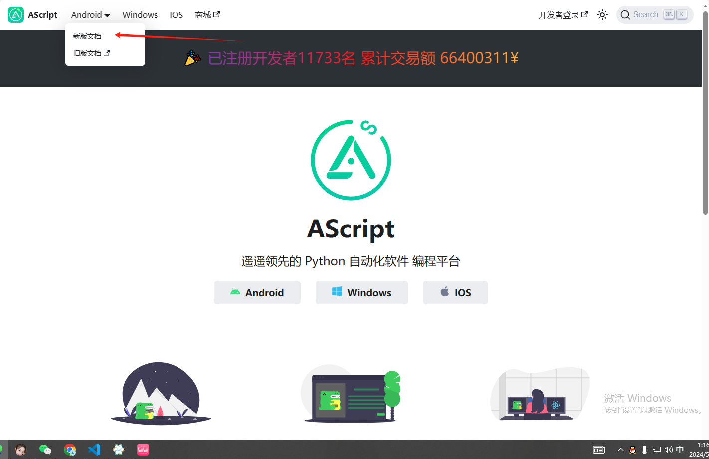
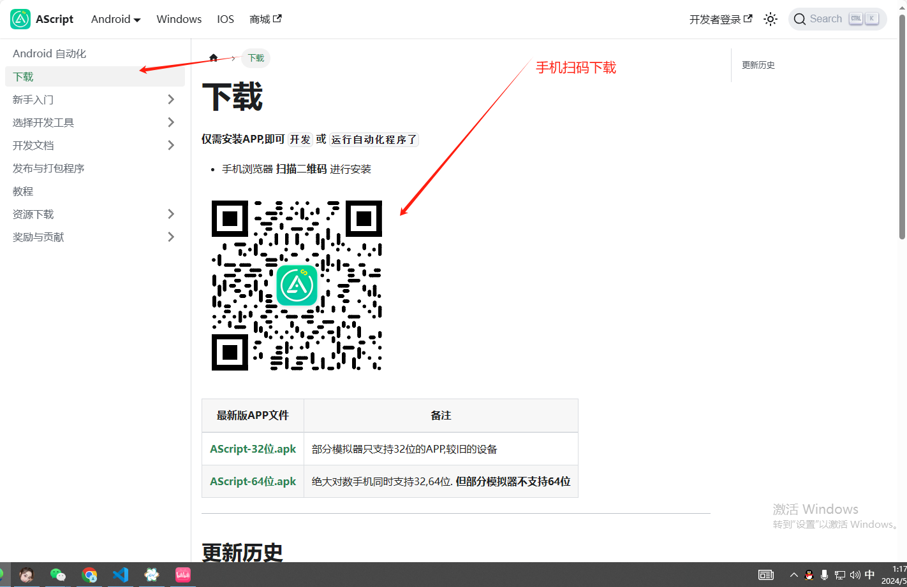
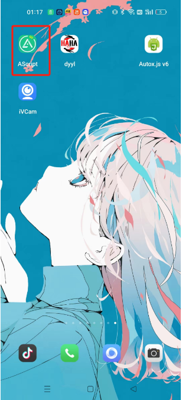
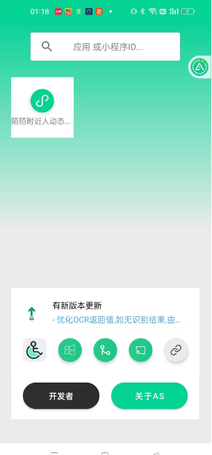
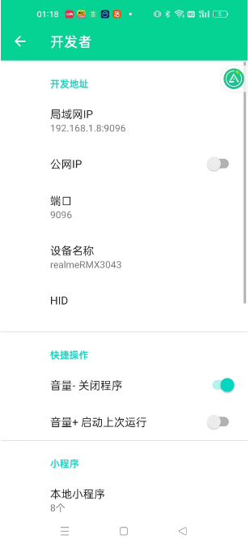
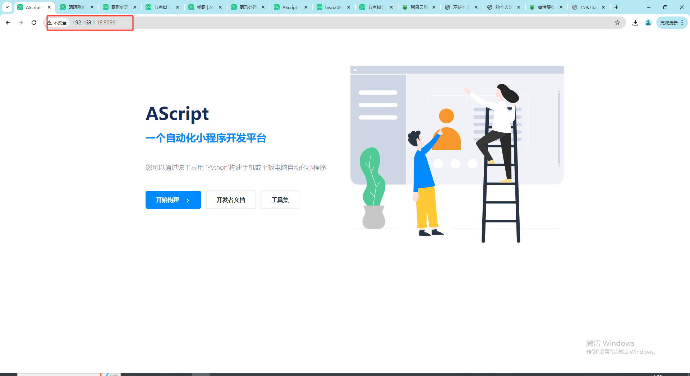
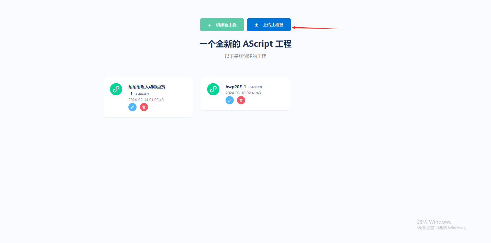
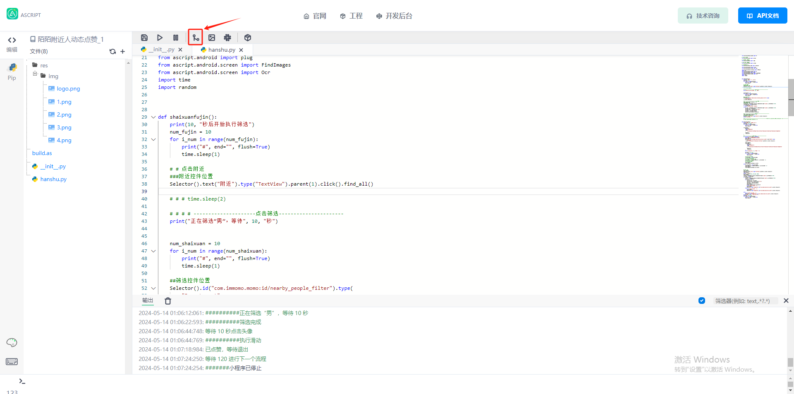
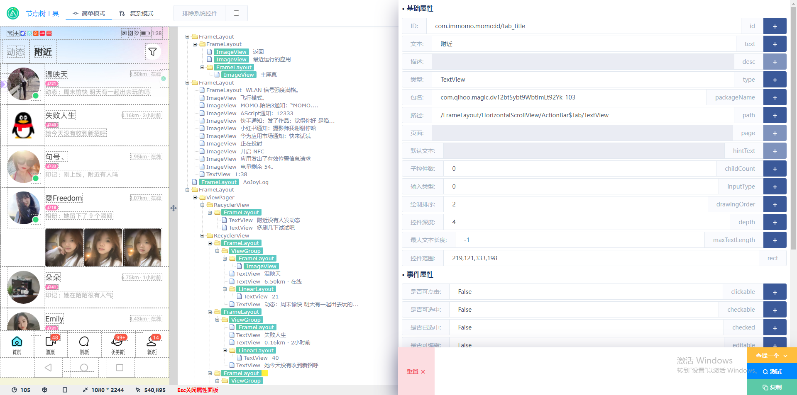
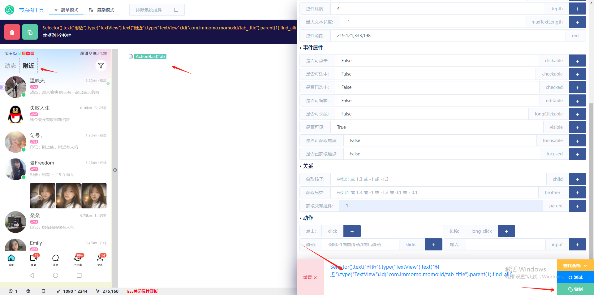

# 脚本功能

* 进入陌陌附近人，筛选男生
* 随机选择用户进入其主页，点赞其动态
* 点赞函数设置执行 20次 也就是 点赞20个用户 如果需要可以在  _init_.py 文件中 while head_i <20: 将20 换成 你需要数字

# 效果演示

下载文件夹内 mp4 文件 观看[演示视频](https://github.com/djsindn/momo-/blob/main/%E9%99%8C%E9%99%8C%E9%99%84%E8%BF%91%E4%BA%BA%E5%8A%A8%E6%80%81%E7%82%B9%E8%B5%9E_1/QQ%E8%A7%86%E9%A2%9120240514011148.mp4)


# 使用教程

[进入as官网  ](http://dev.airscript.cn/)





下载好之后如下图



**打开软件 --> 赋予权限-->点击开发者 查看你的 局域网ip**

在官方文档中有教程 ，比如最好是 电脑跟手机在同一局域网中进行测试 ，如果不在 那么打开公网ip （挺卡的）

在浏览器中输入你的局域网 ip 



点击开始构建 ，上传工程包



**将文件夹内的 .as 文件下载下来，在上传工程包的时候，上传就可以了**

我们有 三种编辑器选择 web 开发 | vscode | pycharm 具体见官方文档

我本人使用的是vscode 

## 使用

那么在上传好工程包之后就需要进行一些配置，原则上来说，如果你的手机也是android 9 的话 脚本是通用的 

如果不是，你可能有一些地方需要修改 

首先来说 目录结构：

```bash
- res             // 静态资源文件夹
   - img          // 程序中调用的图片
   - image        // 额这个是放我readme.md 文件 中的图片的 因为我的md 文件在本地写的
   - ui           // 程序ui
- _init_.py       // 主体执行文件
- hanshu.py       // 封装好的函数
- build.as        //导入其他包   
```

如果你的脚本不能运行 那么 请看 hanshu.py 文件 中 拥有 ‘Selector()’ 字段的内容对应的 控件位置 是否 跟你手机上的控件位置一样

### 如何查找控件

在web编辑器中点击






这里呢就拥有你需要的控件 ，包括如何查找，使用 ，举个例子

我需要查找可点击属性的 附近控件



这里，我选择了 文本 为 附近 id 为 com.。。。 另外寻找他的拥有可点击属性的 父级控件 ,再复制代码 就可以啦，然后根据代码中的 注释 来进行 更改

### 准备就绪

如果你一切准备就绪，那么我们可以进行下一项了。

手机 打开 陌陌 ，点击执行脚本 具体操作参考 视频演示
